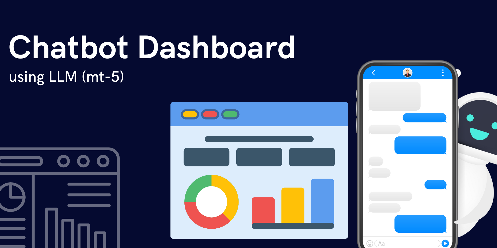
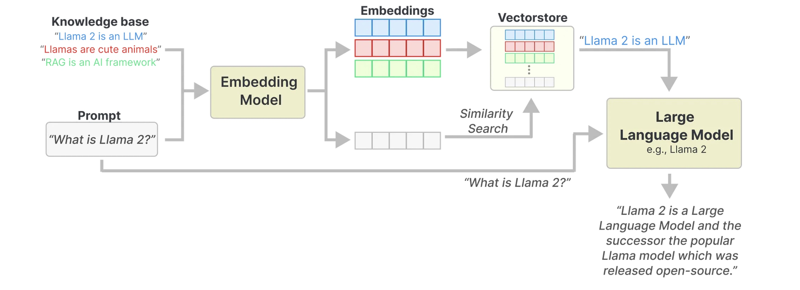

# Dashboard Chatbot

<br />
<div align="center">
  <a href="">
    
  </a>
</div>

<p></p>

<!-- TABLE OF CONTENTS -->
<details>
  <p>
  <summary>Table of Contents</summary>
  <ol>
    <li>
      <a href="#about-the-project">About The Project</a>
      <ul>
        <li><a href="#built-with">Built With</a></li>
      </ul>
    </li>
    <li><a href="#background">Background</a></li>
    <li><a href="#business-values">Business Values</a></li>
    <li><a href="#llm-model">LLM Model</a></li>
    <li><a href="#how-to-works">How to Works</a></li>
    <li>
      <a href="#getting-started">Getting Started</a>
      <ul>
        <li><a href="#installation">Installation</a></li>
      </ul>
    </li>
    <li><a href="#license">License</a></li>
    <li><a href="#Reference">Reference</a></li>
  </ol>
  </p>
</details>


<p></p>

<!-- ABOUT THE PROJECT -->
## About The Project

This is an AI project based on LLM in the form of a chatbot. This chatbot can answer questions related to the company's dashboard. This chatbot can answer related questions about dashboards, such as
- What metrics does this dashboard contain?
- What is the link to the dashboard?
- Which dashboard do specific metrics exist on?


### Built With

These are list any major frameworks/libraries used to make the project.

<div>
  <a href="">
    
  </a>
</div>

## Background
A large company must be very aware of data. Turning data into a visualization dashboard is very important in a company. Visualization dashboards are used to help make decisions or monitor business matrices.

As time goes by, the number of teams or divisions in a company increases. Each team can have more than 5 dashboards in each semester. This makes the number of dashboards increase. The large number makes it increasingly challenging to manage the dashboard, such as remembering which dashboard the financial metrics are on, what the dashboard name is, or remembering that this dashboard has any metrics.

With an LLM-based AI project, we can create a chatbot to ask questions about dashboards, such as what metrics this dashboard contains. What is the dashboard link? and which dashboard is for specific metrics? This AI project will answer the problems above.

## Business Values
- It can make it easier for the data team in a company to manage dashboards from requests from all divisions.
- It can speed up work because it reduces the time to search for the dashboard you want to search for.

## LLM Model
The project using [idT5](https://huggingface.co/muchad/idt5-base) (Indonesian version of [mT5](https://github.com/Wikidepia/indonesian_datasets/tree/master/question-answering/squad))is fine-tuned on 30% of [translated SQuAD v2.0](https://github.com/Wikidepia/indonesian_datasets/tree/master/question-answering/squad) for Question Generation and Question Answering tasks.

mT5-Base has 580 million parameters. Developed by Google, mT5, a variant of the Text-to-Text Transfer Transformer (T5), is designed to understand and generate text across an impressive range of 101 languages. This capability is crucial in a world where digital communication transcends linguistic boundaries. mT5’s extensive language coverage enables it to perform a variety of NLP tasks, from translation to content creation, making it a powerful tool in both research and practical applications. Its versatility and robustness have set a new benchmark in multilingual NLP, marking it as a key player in bridging language gaps in the digital age.


## How to Works

<div align="center">
  <a href="">
    
  </a>
</div>

The project uses the RAG method. In RAG, a knowledge base, like a data summary about the dashboard, is converted to numerical representations to capture its meaning, called embeddings. These embeddings are stored in a vector database to retrieve the information quickly.

Then, when you give the LLM a specific prompt, the vector database searches for information related to the prompt.

The most relevant information is then passed to the LLM as the additional context that it can use to derive its response.

In practice, RAG helps the LLM to “look up” information in its external knowledge base to improve its response.


<!-- GETTING STARTED -->
## Getting Started
This is a tutorial for running a project locally.

### Installation

1. Clone the repo
   ```sh
   git clone https://github.com/ALDOPUTRA07/prediction_delivery_time
   ```
2. Change to the project directory
   ```sh
   cd prediction_delivery_time
   ```
3. Setting up programming environment to run the project
   ```sh
   poetry shell
   ```
4. Install the dependencies
   ```sh
   poetry install
   ```
5. Running the project (Without 🐳 Docker)
   ```sh
   poetry run python app.py
   ```

## License
MIT

<p align="right">(<a href="#automed-forecasting">back to top</a>)</p>

## Reference
Embedding : [firqaaa/indo-sentence-bert-base](https://huggingface.co/firqaaa/indo-sentence-bert-base)

Model QnA: [muchad/idt5-qa-qg LINK](https://huggingface.co/muchad/idt5-qa-qg) 
